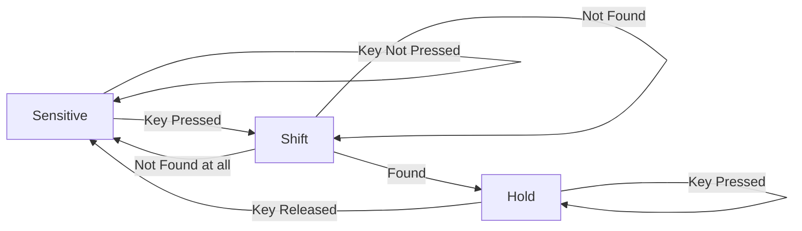
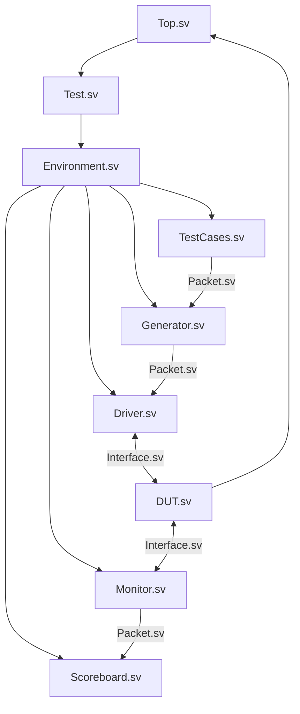

# Specification
## Requirements
- 3x3 Keyboard
- List of supported keys:
  - 0,1,2,3,4,5,6,7,8

## Working
- Matrix keyboard scanner
- Display key pressed

## Test Cases
Invalid cases (2 or more keys pressed)
- 2 keys pressed in the same column
- 2 keys presses in different columns
- Completely random number generated

Valid (only 1 key pressed)
- Single valid key pressed
- Key changed when scanning
- Key removed during scanning

## State Diagram

## A General Order of Development of Files
1. DUT.sv
1. Interface.sv
1. Packet.sv
1. TestCases.sv
1. Generator.sv
1. Driver.sv
1. Monitor.sv
1. Scoreboard.sv
1. Environment.sv
1. Test.sv
1. Top.sv
___
## Design Graph

___
## References
[SystemVerilog coding guidelines](https://www.systemverilog.io/verification/styleguide/)

[More Guidelines](https://github.com/lowRISC/style-guides/blob/master/VerilogCodingStyle.md)

[Branch Education on the working of a keyboard](https://www.youtube.com/watch?v=h-NM1xSSzHQ)

[Computerphile on the working of a keyboard](https://www.youtube.com/watch?v=ewE8b7zzej0)

[Ben Eater on PS2 Keyboard interfacing](https://www.youtube.com/watch?v=7aXbh9VUB3U)

[Ben Eater on Keyboard Interfacing](https://www.youtube.com/watch?v=w1SB9Ry8_Jg)

[Ben Eater on USB Keyboard Encoding](https://www.youtube.com/watch?v=wdgULBpRoXk)

[Hexadecimal Keyboard Scanner and Encoder](https://www.youtube.com/watch?v=Y1cp2kwos5M)

[Sample Verilog Code](https://stackoverflow.com/questions/14267622/keybord-interface-design-in-verilog)

[Crazy Ass FSM](https://embeddedthoughts.com/2016/07/05/fpga-keyboard-interface/)

[Generating random numbers in Verilog](https://stackoverflow.com/questions/34011576/generating-random-numbers-in-verilog)

